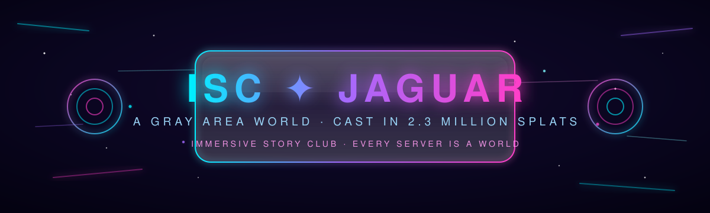

 

-7df9ff?style=for-the-badge&labelColor=0a0620)

<h3><em>Every server is a world. This is the first stone of ours.</em></h3>

 

---

## 🜂 The Legend

Somewhere in San Francisco stands [**Gray Area**](https://grayarea.org) — a temple where art and technology have been colliding for years. One night, the **Immersive Story Club** walked its halls with an XGRIDS **PortalCam** and pulled the whole room through the lens: **2.34 million points of light**, frozen mid-shimmer, roughly **39m × 23m × 10m** of real space folded into a file.

This repository is that captured world — our **hippoCAMP**. Base camp and memory palace in one. The Discord is where we gather around the fire; this repo is the territory itself. Clone it, walk it, bend it, haunt it, and bring back stories.

> 🌀 **New traveler?** Start with [Portals](#-portals--how-to-enter-the-world) below. If you build in Unity or Unreal, you can be *standing inside Gray Area* in about ten minutes.

---

## 💠 The Cargo Manifest

| Artifact | What it truly is |
|---|---|
| 🔮 `lcc-result/` | **The world itself.** Gaussian splat scene in XGRIDS LCC format — `Jaguar.lcc` is the sigil (manifest), `data.bin` holds all 2.3M splats across 3 LODs, `collision.lci` + `environment.bin` carry physics & ambience, `assets/poses.json` is the path the scanner walked |
| 🦴 `mesh-files/Jaguar.ply` | **The skeleton.** Low-poly collision mesh — 26,711 verts / 48,968 tris, binary PLY, *no color*. Perfect for physics, nav meshes, and blockouts. It is not the pretty one. Do not fall in love with it |
| 🌀 `viewer/` | **The portal.** Three.js + LCC Web SDK viewer — [enter here](https://innercartography.github.io/ISC.jaguar/), or run locally and **fork a layer** (see below) |
| 🌌 `exports/` | **The translation chamber.** Standard-format exports (3DGS `.ply` / `.spz`) will materialize here — see [Quests](#-quests--help-wanted) |
| ✨ `media/` | Banners, thumbnails, and other glow |

---

## 🌀 Portals — how to enter the world

The LCC format is XGRIDS-native. Free keys to the gate at [xgrids.com](https://xgrids.com):

- 🎮 **Unity** — the *LCC for Unity* plugin loads `Jaguar.lcc` straight in: splats, LODs, collision, everything. **The royal road for VR builds.**
- 🛸 **Unreal** — *LCC for Unreal* plugin. Same power, different engine.
- 🖥️ **Desktop** — *Lixel Studio* opens the scene for viewing, cleanup, and re-export to common formats.
- 🌐 **Web** — XGRIDS' *LCC for Web* SDK / Reveal can serve the Portable LCC in a browser.
- 🦴 **The skeleton** (`mesh-files/Jaguar.ply`) opens anywhere — Blender, MeshLab, three.js — but remember: uncolored collision geometry only.

### ⚗️ No XGRIDS tools? The universal translation

What you want is a standard **3DGS export** — the first quest below. Once `exports/Jaguar.spz` (or a 3DGS `.ply`) lands here, the world opens to everyone:

- 🕶️ Drop it into [**SuperSplat**](https://superspl.at/editor) in your browser — edit, clean, then **publish a walk-around link** that works on any laptop *and in VR straight from a Quest headset's browser*. No installs. One link. That link is the true Discord artifact.
- 🎨 Import into Blender via a 3DGS add-on, or Polycam, Gracia, and the rest of the multiverse.

---

## ⚔️ Quests — help wanted

| | Quest | Reward |
|---|---|---|
| ☐ | **Forge the universal key** — export standard 3DGS `.ply` + `.spz` from Lixel Studio into `exports/` (prefer `.spz`: ~10× smaller; a raw 2.3M-splat PLY is ~500MB and would summon Git LFS) | The world opens to every tool |
| ☑ | **Light the beacon** — one-click browser entry, live at [the portal](https://innercartography.github.io/ISC.jaguar/) | ✦ done |
| ☐ | **Lay the first tracks** — roam the viewer, capture waypoints, fork the first story layers | Your name in the lineage |
| ☐ | **Banish the floaters** — a cleaned, cropped hero cut of the scan | Beauty |
| ☐ | **Restore the true image** — `lcc-result/thumb.jpg` came out dark; capture a luminous replacement | A worthy face for the repo |
| ☐ | **First stories** — what happened in this room? Build it. Show us | Legend status |

---

## 🧬 Layers — how the world compounds

The viewer speaks in **layers**: one storyteller's waypoints and views over the shared scan. The scan is immutable; layers stack on top, and every layer names the layer it forked from — so contributions **compound**, and anything you see **traces back to the original capture** in one glance (the HUD shows the full lineage: `origin → mika → you`).

Fork one in four steps — full guide in [`viewer/README.md`](viewer/README.md):

1. Copy `viewer/src/layers/origin.js` to `<your-handle>-<story>.js`
2. Set `author`, `tint`, and the sacred field: `forkedFrom`
3. Roam free (`M`), capture waypoints (`P`), paste them in
4. Register in `layers/index.js` → PR it back → your world joins the stack

## 📜 The Codex (contributing)

Fork it. Remix it. PR it. Three laws:

1. 🏛️ The raw capture in `lcc-result/` is **sacred ground** — never modify it in place.
2. 🌱 New versions, cuts, and translations go in `exports/`, new stories go in `viewer/src/layers/` — never edit someone else's layer; fork it.
3. 🔥 Works-in-progress belong around the fire — share early in the Discord.

---

## ⚖️ The Pact (license)

**Proposed: [CC BY 4.0](https://creativecommons.org/licenses/by/4.0/)** — remix freely, credit *"Immersive Story Club — Gray Area scan (Jaguar)."*
Not final until the club speaks. Opinions → the Discord.

---

🜂 &nbsp; *scanned at Gray Area · San Francisco · MMXXVI* &nbsp; 🜂

**IMMERSIVE STORY CLUB** — birthed in Discord, destined for the medium that doesn't have a name yet

